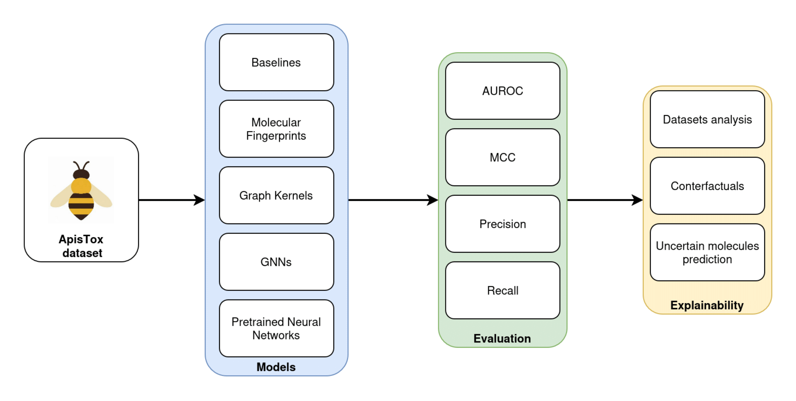

# Evaluating machine learning models for predicting pesticides toxicity to honey bees

This repository contains code for building and evaluating machine learning models
using [ApisTox dataset](https://github.com/j-adamczyk/ApisTox_dataset), from publication
[in Scientific Data](https://www.nature.com/articles/s41597-024-04232-w). ArXiv preprint is [available here](https://arxiv.org/abs/2503.24305).

Dataset is shared under [CC-BY-NC-4.0 license](https://creativecommons.org/licenses/by-nc/4.0/)
Code is shared under MIT license, except for `huggingmolecules` library code, which
uses Apache 2.0 license.

## Reproducing results

Install [uv](https://docs.astral.sh/uv/) and set up the virtual environment with `uv sync`.
All dependencies are pinned in `pyproject.toml` and `uv.lock` files. You can also use the
provided Makefile and run `make install`.

## Dataset files

All input data files from ApisTox dataset are in `data` directory.

## Code for experiments

All relevant scripts are in `src` directory.

Models training & evaluation:
- `baselines.py` - atom counts, LTP and MOLTOP baselines
- `fingerprints.py` - molecular fingerprints
- `graph_kernels.py` - graph kernels
- `gnns.py` - graph neural networks trained from scratch
- `embedding_models.py` - pretrained neural models for molecular embeddings

Data and results analysis:
- `analysis_datasets_features.py` - analysis and comparison of dataset properties
- `analysis_counterfactuals.py` - counterfactual examples model interpretability
- `analysis_uncertain_data.py` - predictions for uncertain molecules

`huggingmolecules` directory contains [huggingmolecules](https://github.com/gmum/huggingmolecules)
library code. It uses the original Apache 2.0 license. The only change to the original
code was automatic reformatting with `ruff`.
